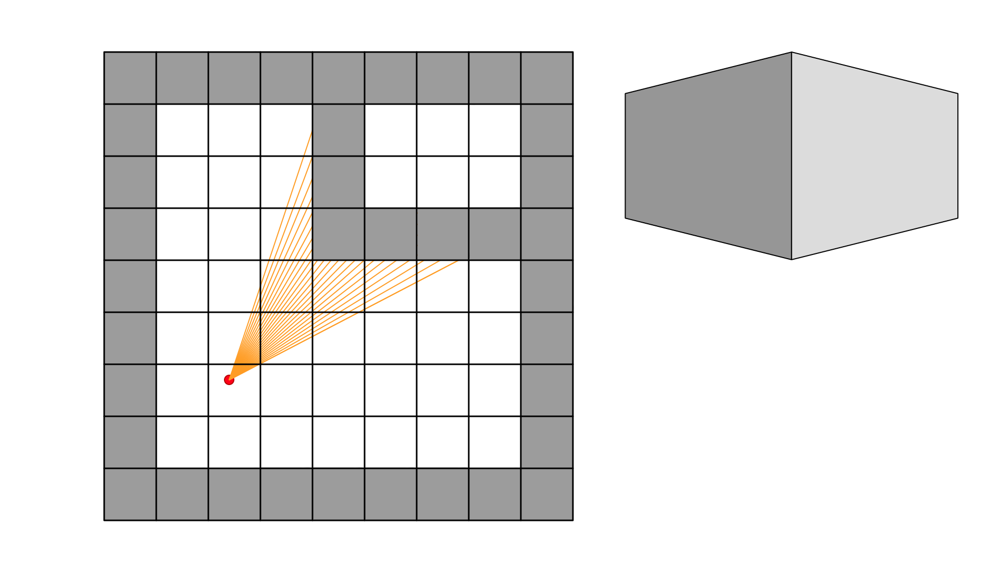
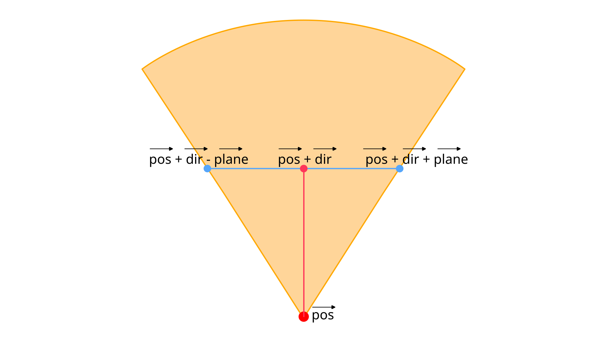
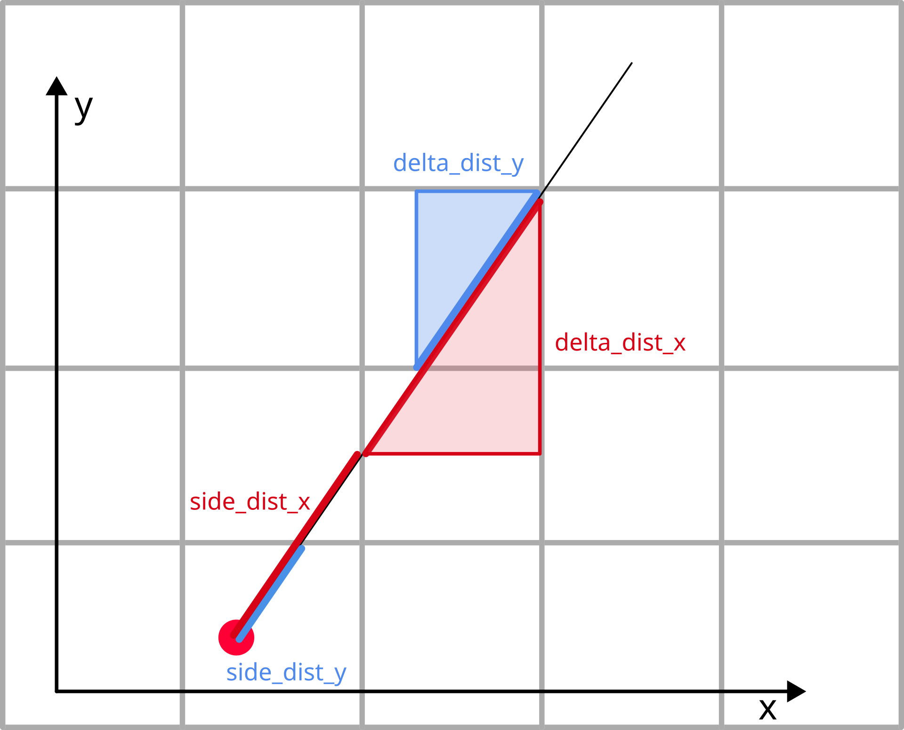
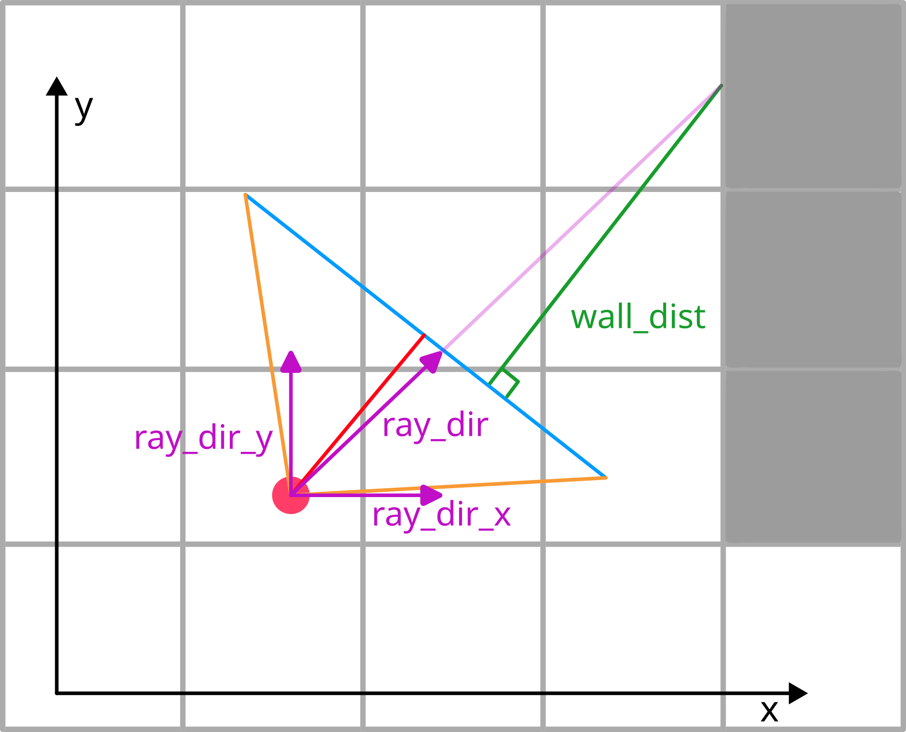

# Algorithm

The [raycasting](https://en.wikipedia.org/wiki/Ray_casting) technique I'm using
was described in the [article](https://lodev.org/cgtutor/raycasting.html) by
Lode Vandevenne with reference implementation in C++. I highly suggest reading
the original work, because I won't cover everything in detail, and even if I
did, my explanation wouldn't be as good.

The algorithm uses IEEE 754 floating point numbers, which is too expensive for
dedicated hardware in terms of area and latency/timing, so RTL implementation
uses fixed point numbers instead, and has to deal with very limited precision.
But for the sake of simplicity, fixed point related changes to the algorithm are
covered separately.

The main idea behind any raycaster is that your map is actually represented as
a matrix in 2D space, like you are looking at it from the top. The player
on the map projects rays in their field of view, and calculates the distance from
the ray to the wall. The greater the distance, the further away the wall is from
the player, the smaller it should appear on the screen.



Wikipedia has a cool
[GIF](https://en.wikipedia.org/wiki/Ray_casting#/media/File:Simple_raycasting_with_fisheye_correction.gif)
to see that in action.

This algorithm was used in some old video games (famously in Wolfenstein 3D) for
its efficiency, because you have to calculate ray distance only once for the
whole screen column. In 480x640 resolution that means only 640 ray calculations
for each frame.

In order to cast rays, we'll need 3 main vectors: player position vector, camera
direction vector and camera plane vector.



Red dot at the bottom is player position, red line in the middle is the
direction vector ending in the middle of a blue line, which is a plane vector.

Direction is needed to rotate the field of view and it points to the center of a
camera plane, which represents the surface of a screen. Because all calculations
are in 2D, the camera plane is actually just a line. To get a proper image,
direction vector is perpendicular to plane vector. The actual ray distance would
be calculated perpendicularly to the camera plane to avoid fisheye effect that
some other raycasting techniques have.

The field of view is in the [-plane, +plane] range, so in order to calculate ray
direction for a specific column on the screen, we map pixel X value, which is
in range from 0 to frame width - 1, to the range [-1, 1) and multiply the plane
vector by that value and add direction vector. For example, a ray in the
rightmost quarter of a plane would have a direction `dir + plane * 0.6`.

In order to look right and left, we'll need to rotate the direction vector and
recalculate plane vector, so it always stays perpendicular.

## Python floating point model

You can find model functions in `tb/models.py` in functions `float_model` and
`controls_float`.

Some init values are grabbed from RTL code, so these are not present in the
Python model.

But basically the map is just a 2D array, with 0 representing empty space and
values greater than 0 are different wall textures.

Starting values of 3 main vectors:

```Python
pos_x = 10
pos_y = 10

dir_x = -1
dir_y = 0

plane_x = 0
plane_y = 0.66
```

The field of view is determined by the ratio between direction and plane vector
lengths, and given dir length is 1, plane length 0.66 gives 66 degrees FOV,
which looks nice.

```Python
for x in range(0, FRAME_WIDTH):
    ray_x = 2 * x / FRAME_WIDTH - 1
    ray_dir_x = dir_x + plane_x * ray_x
    ray_dir_y = dir_y + plane_y * ray_x
```

We start raycasting with a loop which goes through all X coordinates on the
screen, because we have to calculate wall height only once for the whole screen
column.

`ray_x` is the multiplication factor in the range [-1, 1), so the leftmost
screen side is -1, center is 0 and rightmost is 1. Then ray direction is
calculated for x and y coordinates of the vector.

Position coordinates are floating point values on a 2D map, where each square
has a length of 1, so the integer part of position represents in which square
the player is, and the fractional part represents position inside that square.

In order to calculate full ray distance, we'll need to know 1) the ray distance
from the position point to the cell border 2) the ray distance from one cell
border to the other (either in the X or Y axis).



`side_dist_*` is the initial distance, and `delta_dist_*` is the value
that would increment the distance until we hit the wall.

The obvious way to calculate delta distances is through the Pythagorean theorem,
but for our distance calculation algorithm we don't actually need exact x/y ray
lengths, but rather their relative values, so we can significantly simplify the
formula. If you are actually interested in the proof and derivation, check out
the original algorithm article.

In the end we get:

```Python
delta_dist_x = 1e30 if ray_dir_x == 0 else 1 / abs(ray_dir_x)
delta_dist_y = 1e30 if ray_dir_y == 0 else 1 / abs(ray_dir_y)
```

Assigning an arbitrarily large value to avoid division by 0.

To calculate `side_dist_*`, we need the distance to the border in the ray
direction, so if the direction value is positive, we subtract the original
position from the integer part incremented by 1, otherwise we just take the
fractional part of position. This value is the fraction of the cell which the
ray has traveled, so now we have to scale it by `delta_dist_*` to get the final
distance value.

```Python
map_x = int(pos_x)
map_y = int(pos_y)

if ray_dir_x > 0:
    step_x = 1
    side_dist_x = (map_x + 1 - pos_x) * delta_dist_x
else:
    step_x = -1
    side_dist_x = (pos_x - map_x) * delta_dist_x

if ray_dir_y > 0:
    step_y = 1
    side_dist_y = (map_y + 1 - pos_y) * delta_dist_y
else:
    step_y = -1
    side_dist_y = (pos_y - map_y) * delta_dist_y
```

If the ray direction is negative, then later we'll be moving in a negative
direction, so the step is -1.

The next step is finally calculating ray distance before it hits the wall. The
algorithm is called [Digital Differential
Analyzer](https://en.wikipedia.org/wiki/Digital_differential_analyzer_(graphics_algorithm))
(DDA), which might sound like something complicated, but it's actually pretty
simple: we start at the square that corresponds to our position, and then move 1
square at a time in either the X or Y direction until we reach the square that is
the wall.

The direction depends on the length of X and Y projections of the ray: if the X
projection is shorter, we move in the X direction and increment it, otherwise
we move in the Y direction.

```Python
while True:
    if int(game_map[(map_y * MAP_SIDE) + map_x]):
        break

    if side_dist_x < side_dist_y:
        hit_side = 0
        side_dist_x += delta_dist_x
        map_x += step_x
    else:
        hit_side = 1
        side_dist_y += delta_dist_y
        map_y += step_y
```

We also keep track of which side of the cell has been hit: vertical or
horizontal. This is needed to apply a simple shading effect to the texture, to
mimic some sort of lighting source.

```Python
texture = int(game_map[(map_y * MAP_SIDE) + map_x]) - 1

if hit_side == 0:
    wall_dist = side_dist_x - delta_dist_x
    tex_shade = 0
else:
    wall_dist = side_dist_y - delta_dist_y
    tex_shade = 1
```

After we reach the cell corresponding to the wall, we grab its texture
number. We also have to go one iteration back and subtract the last increment,
because by reaching the wall cell, we went through the wall's surface, and by
going back we end up right on it. It's actually a bit more complicated than
that. By subtraction we're getting the distance perpendicular to the camera
plane. Again, I suggest reading the original article.

```Python
if wall_dist == 0:
    tex_height = FRAME_HEIGHT
else:
    tex_height = FRAME_HEIGHT / wall_dist
```

The texture height is the inverse of the ray distance (the further the wall, the
smaller it appears) multiplied by the frame height.

The wall center is aligned with the center of the screen, so we calculate the
start and end positions like this:

```Python
tex_start = FRAME_HEIGHT // 2 - tex_height // 2
tex_end = FRAME_HEIGHT // 2 + tex_height // 2
```

Because we use textures, we also have to know *where exactly* the ray landed, so
we can output the correct pixel color. To do this, we need two things: 1) a step
in the vertical direction 2) the X coordinate inside the cell texture.

In our case, we are using 32x32 textures for all walls. But if we are too far
from the wall, it might be smaller than 32 pixels in height. In this case we
have to skip some pixels from the texture. But if we are close enough, the wall
is higher than 32 pixels, so we have to duplicate the same texture pixel
multiple times on the screen. To scale the screen Y coordinate to the texture Y
coordinate, the step is calculated based on distance, texture height and screen
height.

The length of the `ray_dir` vector is $\sqrt{1^2 + 0.66^2} \approx 1.2$, so
`ray_dir_x` and `ray_dir_y` projections are in that range as well. To find the
exact position where the ray hits the wall, we multiply `wall_dist` by the
`ray_dir` projection and add that value to initial position. The greater the
projection, the greater the wall distance in that axis.  There are 2 cases: if
the ray hits a horizontal edge, the texture X position is based on `ray_dir_x`
and `pos_x`, and if the ray hits a vertical edge, texture X position is based on
`ray_dir_y` and `pos_y`.



After getting the exact coordinate, we take the fractional part that represents
the cell location of the ray. Then this value is multiplied by the texture width
and rounded to an integer to get the texture X value. Depending on the ray
direction and wall surface orientation, we might also need to mirror the
coordinate, so the texture 0 would always appear on the left, regardless of
camera orientation.

```Python
tex_step = wall_dist * TEX_SIDE / FRAME_HEIGHT

if hit_side == 0:
    coord_x = wall_dist * ray_dir_y + pos_y
else:
    coord_x = wall_dist * ray_dir_x + pos_x

tex_x = int((coord_x - math.floor(coord_x)) * TEX_SIDE)

if hit_side == 0 and ray_dir_x > 0:
    tex_x = TEX_SIDE - 1 - tex_x
if hit_side == 1 and ray_dir_y < 0:
    tex_x = TEX_SIDE - 1 - tex_x
```

Finally, the second loop in the vertical direction. To find the texture pixel Y
coordinate, we subtract the texture start position from the screen coordinate,
so the top texture row would start from 0, and then we multiply that value by
`tex_step` to scale each pixel. That value might go beyond the texture height,
so we constrain it to the maximum value in that case.

Then the corresponding texture is grabbed from the textures array, and the shade
is applied by bit shifting each RGB value by 1 if necessary.

```Python
for y in range(FRAME_HEIGHT):
    if y >= tex_start and y < tex_end:
        raw_y_pos = (y - tex_start) * tex_step
        tex_y = min(TEX_SIDE - 1, int(raw_y_pos))

        px_color = textures[texture].getpixel((tex_x, tex_y))
        r, g, b = px_color
        if tex_shade:
            px_color = (r >> 1, g >> 1, b >> 1)
        else:
            px_color = (r, g, b)
```

That's it for the rendering. Let's look at the movement and rotation.

To change the position, we need to know which control keys were pressed. Then we
scale the direction vector by the movement speed constant, add that value to
the position vector, and check that the new position is not inside the wall
(simple collision detection), before updating the coordinate. This is done for
both axes.

```Python
def update_pos(dir, is_x):
    global pos_x, pos_y

    if is_x:
        update_axis = pos_x
    else:
        update_axis = pos_y

    new_pos = update_axis + dir * MOVEMENT_SPEED

    if is_x and int(game_map[(int(pos_y) * MAP_SIDE) + int(new_pos)] == 0):
        pos_x = new_pos
    elif not is_x and int(
        game_map[(int(new_pos) * MAP_SIDE) + int(pos_x)] == 0
    ):
        pos_y = new_pos
```

For example, if the forward key was pressed, then we have to move forward, so a
positive direction is passed to the `update_pos` function. If we move backward,
then a negative direction is passed, etc.

```Python
if forward:
    update_pos(dir_x, 1)
    update_pos(dir_y, 0)
if backward:
    update_pos(-dir_x, 1)
    update_pos(-dir_y, 0)
if left:
    update_pos(-dir_y, 1)
    update_pos(dir_x, 0)
if right:
    update_pos(dir_y, 1)
    update_pos(-dir_x, 0)
```

For camera rotation, we have to rotate both the direction and plane vectors.
To do so, they are multiplied by the [rotation
matrix](https://en.wikipedia.org/wiki/Rotation_matrix). See this
[derivation](https://matthew-brett.github.io/teaching/rotation_2d.html) to
understand how it works. In our case, the rotation angle is the speed constant.
To rotate left (anticlockwise), we pass the positive angle, to rotate right
(clockwise), we pass a negative angle.

```Python
def rotate(angle):
    global dir_x, dir_y, plane_x, plane_y
    old_dir_x = dir_x
    dir_x = dir_x * math.cos(angle) - dir_y * math.sin(angle)
    dir_y = old_dir_x * math.sin(angle) + dir_y * math.cos(angle)
    old_plane_x = plane_x
    plane_x = plane_x * math.cos(angle) - plane_y * math.sin(angle)
    plane_y = old_plane_x * math.sin(angle) + plane_y * math.cos(angle)

if rotate_right:
    rotate(-ROTATION_SPEED)

if rotate_left:
    rotate(ROTATION_SPEED)
```

The final result looks like this:


To find out why such an efficient algorithm is running in glorious 4 FPS on
modern hardware, read how [simulation environment](sim.md) was implemented.
