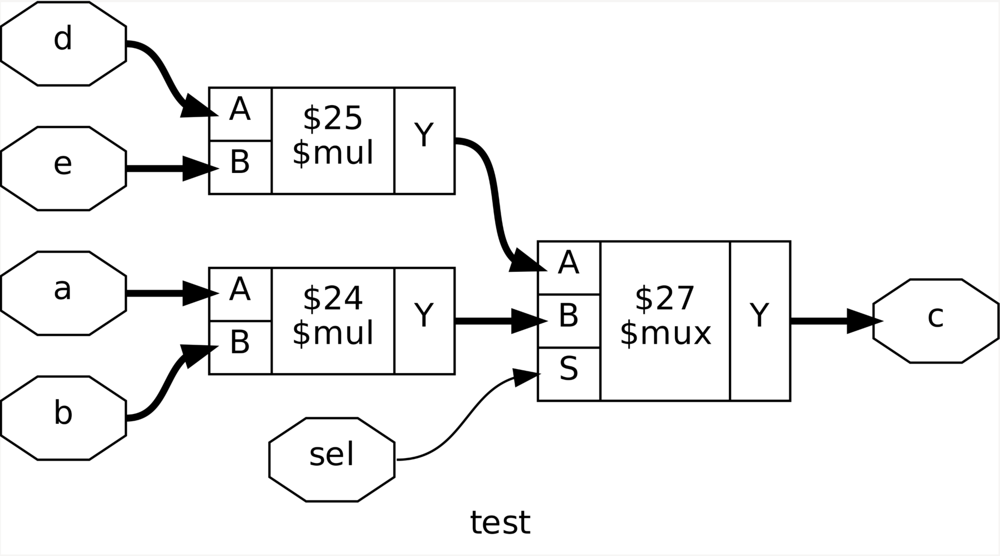
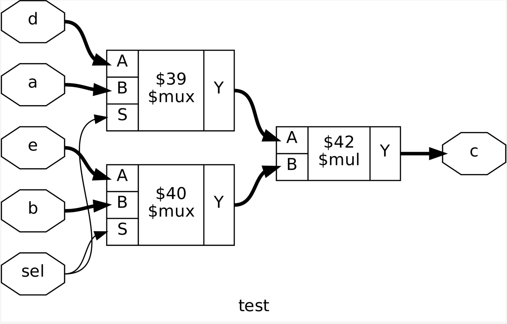
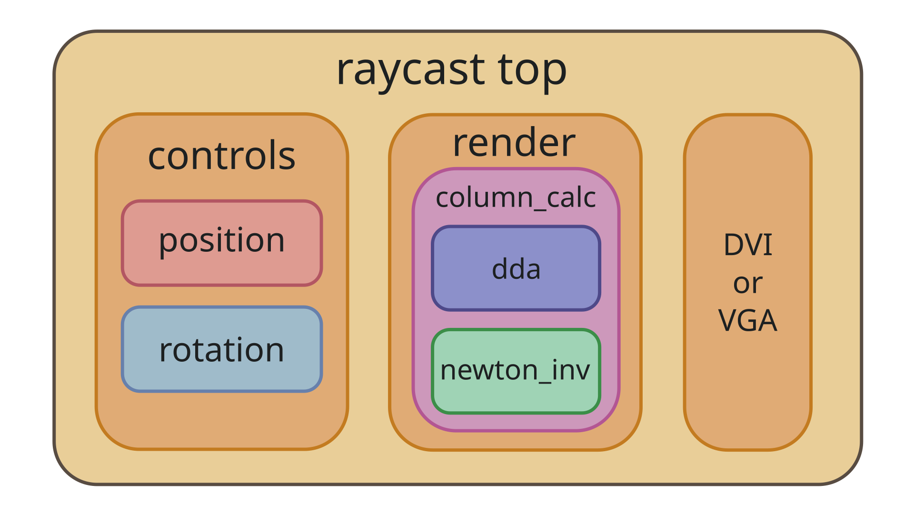
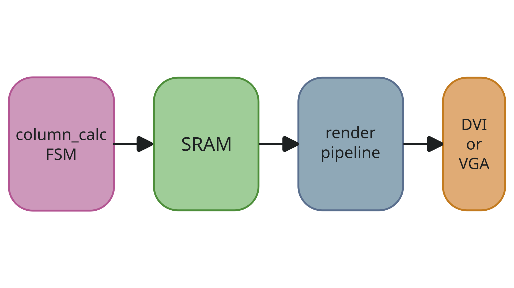

# RTL implementation

This page assumes that you're already familiar with the
[algorithm](algorithm.md).

I won't cover everything here, because there's too much code and it's kinda
boring, but we're gonna look at some interesting parts.

The current target is the Tang Primer 20K FPGA board. But the code is fairly
portable, so you can adapt it to any target with DVI or VGA output by changing
the wrapper around the `raycast_top` module.

I was exploring synthesizable SystemVerilog during the creation of this project,
so currently the code is verified to work with the
[yosys-slang](https://github.com/povik/yosys-slang) frontend plugin for Yosys.
It uses some features of the language, like the `type()` operator, which the
native Yosys frontend can't handle.

We'll use 7 32x32 textures on a 32x32 square map. The screen resolution is
classic 480x640. Because we only need to calculate 640 rays, there's no reason
to make the whole raycaster pipelined; it would just stay empty most of the
time, and it's a huge resource waste in terms of gates or LUTs. To make the
design a bit more challenging, I tried to focus on making it as light as
possible on resources.

## Resource sharing

The main idea is to utilize resource sharing synthesis optimization.

```SystemVerilog
always_comb
    if (sel)
        c = a * b;
    else
        c = d * e;
```

In the code above, a synthesizer like Yosys is able to recognize that the `sel`
signal activates only one multiplier cell at a time, so 2 multipliers could be
merged into just 1, with a multiplexer managing input signals.

Let's see how this happens in Yosys. This is the design after reading the source
file and running `proc` and `clean` passes. We need `proc` to replace the
`always_comb` process cell with a multiplexer cell and `clean` to get rid of a
redundant cell created by `proc`.

No optimizations have been done yet, as you can see, SystemVerilog code has been
translated to cells quite literally.



And now let's run the `share` pass to merge multipliers and then the `opt` to
simplify the logic a bit:



After the `share` pass we have the following log:

```Text
yosys> share

30. Executing SHARE pass (SAT-based resource sharing).
Found 2 cells in module test that may be considered for resource sharing.
  Analyzing resource sharing options for $mul$test.sv:4$30 ($mul):
    Found 1 activation_patterns using ctrl signal \sel.
    Found 1 candidates: $mul$test.sv:6$31
    Analyzing resource sharing with $mul$test.sv:6$31 ($mul):
      Found 1 activation_patterns using ctrl signal \sel.
      Activation pattern for cell $mul$test.sv:4$30: \sel = 1'1
      Activation pattern for cell $mul$test.sv:6$31: \sel = 1'0
      According to the SAT solver this pair of cells can be shared.
```

It found that `$mul` cells could be merged based on a shared control signal.

By comparing FSM state value with some constants, we can enable only
certain chunks of logic at a time, so some resources between them could be
shared.

## Fixed point

One of the most challenging parts of implementing this raycaster was to make the
floating point algorithm work with fixed point.

For fixed point numbers in SystemVerilog, I'm using `[INT-1:-FRAC]` notation,
this means that all bits from 0 to the maximum value represent an integer part,
and all bits in the negative index range represent the fractional part (yes,
negative indexes are allowed in SV). For example, `logic [7:-10] foo` represents
a fixed point number with 8 integer bits (7 to 0), and 10 fractional bits (-1 to
-10).

This fixed point representation is very convenient, because you don't have to
pass additional metadata with a data object to determine integer and fractional
parts, the data object stores this information in itself. You can get the
integer amount of bits with `$left(foo) + 1` and the fractional amount with
`-$right(foo)`.

This is very neat for fixed point operations, which I'll describe later.

### Types

I started with a fixed point Python model and just tried different bit widths to
get the balance between resource usage and bad image quality. I came up with the
following settings in the end, you can find it in `rtl/include/fixp_pkg.svh`.

I divided all fixed point numbers into SystemVerilog data types. Each type has
its own parameters for integer and fractional parts.

Some of the types:

```SystemVerilog
localparam int unsigned RAY_W_INT      = 2;
localparam int unsigned RAY_W_FRAC     = 10;

localparam int unsigned POS_W_INT      = 5;
localparam int unsigned POS_W_FRAC     = 8;

localparam int unsigned SIDE_W_INT     = 1;
localparam int unsigned SIDE_W_FRAC    = 8;

localparam int unsigned EXT_POS_W_INT  = 8;
localparam int unsigned EXT_POS_W_FRAC = 8;

typedef logic signed [RAY_W_INT-1:-signed'(RAY_W_FRAC)]         ray_fixp_t;
typedef logic        [POS_W_INT-1:-signed'(POS_W_FRAC)]         pos_fixp_t;
typedef logic        [SIDE_W_INT-1:-signed'(SIDE_W_FRAC)]       side_fixp_t;
typedef logic        [EXT_POS_W_INT-1:-signed'(EXT_POS_W_FRAC)] ext_pos_fixp_t;
```

Because I prefer to set parameter types explicitly, in this case to `int
unsigned` type, fractional width has to be cast to `signed` before making it
negative, otherwise we'll have a very large positive value in 2's complement
form, because in SV, the result is unsigned if any of the operands is unsigned.

The ray direction vector has a length of 1, with a value in the range [-1, 1],
so 2 bits is enough for the integer part. The fractional part could be reduced
even further, but the texture quality would drop significantly, so 10 bits is a
sweet spot.

The largest value the position data type can hold is the ray distance, which for
a 32x32 map is the diagonal $\sqrt{32^2 + 32^2} \approx 45.3$, which won't fit
in 5 integer bits, but my map doesn't have large open spaces, so the rays are
short enough to fit. For an open map, integer bit width has to be increased. The
fractional part of position is needed for the ray and texture pixel calculation,
again anything below 8 bits just looks very bad.

The side type is for position inside a single map square, so the value won't
exceed 1.

Extended position is needed for calculating the delta step between the cell
edges; if the ray is almost parallel, that value is large and will overflow 5
bits, 8 bits provide extra precision and prevent most overflows. If the result
is larger than 8 bits, then it gets clipped to the maximum value.

### Macros

Some might say that this is extremely cursed, but I don't care.

The biggest problem for me with fixed point arithmetic is multiplication. Let's
take 2 operands of the following type: `logic [3:-5]`. There are 9 bits in
total, so the multiplication result is 18 bits. But what if we don't want to
increase the width every time we multiply? For simple integers, we just truncate
from the MSB. But in the case of fixed point, multiplication results in 8
integer bits and 10 fractional bits, so in order to preserve the point in the
right place, we have to grab the result in the middle.

The algorithm is to get the expanded multiplication result, shift bits to the
right by the amount of fractional bits in the original operand type, and then
cast it to the operand type to truncate bits from the left. Tedious to do that
by hand all the time, so I created a macro:

```SystemVerilog
`define FIXP_MULT_TRUNC(a, b) \
    type(a)'((2 * $size(a))'((a * b) >> -$right(a)))
```

The neat part is that it only requires passing 2 operands (although of the same
type) and no additional information. `type()` operator allows getting the type
of the operand and then we cast the result to that type.

The multiplication above just truncates fractional bits, which results in lower
precision. There is a second multiplication macro in case rounding is needed:

```SystemVerilog
`define FIXP_MULT(a, b)              \
    type(a)'(                        \
        (2 * $size(a))'(             \
            ((a * b) +               \
            (1 << (-$right(a) - 1))) \
            >> -$right(a)            \
        )                            \
    )
```

There are also macros to convert real and integer numbers to fixed point, which
are used to convert the parameters for initial values at elaboration time:

```SystemVerilog
`define REAL_TO_FIXP(real_num, T) \
    T'(real_num * 2 ** (-$right(T)))

`define INT_TO_FIXP(int_num, T) \
    T'({ ($left(T) + 1)'(int_num), { -$right(T) {1'b0} } })
```

And my favourite macro is the one that casts a fixed point number of one type to
the other type:

```SystemVerilog
`define FIXP_CAST(num, T)                                                      \
    T'({                                                                       \
        (-$right(num) - -$right(T) > 0) ?                                      \
            (type(num)'('1) < 0) ?  /* Checks that type is signed */           \
                T'(signed'({signed'(num) >>> (-$right(num) - -$right(T)) })) : \
                T'(        {       (num) >>  (-$right(num) - -$right(T)) })  : \
            (T'(num) << (-$right(T) - -$right(num)))                           \
    })
```

First, we are shifting the value to change fractional number of bits. If we
have to truncate, we shift right, otherwise we shift left. Also, the number
might be signed; in this case, we have to perform arithmetic shift to preserve
the sign. To check if the type of the operand is signed, we create a number with
all bits set to 1 and see if the result is less than 0: `type(num)'('1) < 0`,
which is a very cool trick, so
[thanks](https://verificationacademy.com/forums/t/determining-whether-type-parameter-is-signed-or-unsigned/37857/2)
to dave_59 for it. Finally, we cast the result to the target type to
truncate/expand the integer part.

You might wonder why I use concatenation curly braces with only one element. It
is done to isolate the bit length of macro expressions from the outer expression
context. Concatenation operands are self-determined (IEEE 1800-2023 11.6.1), so
expressions inside and outside the macro have fully separate contexts and won't
influence each other. Otherwise, macro expressions might result in unexpected
expansion of other operands. The side effect is that the result of concatenation
is always unsigned (IEEE 1800-2023 11.8.1), so the resulting value has to be
explicitly cast to be signed if needed.

## Hierarchy

The main parts of the raycaster are the render, controls and DVI/VGA modules.
The whole structure is the following:



DVI and VGA won't be covered here. DVI has its own
[repository](https://github.com/max-kudinov/open_dvi) and VGA has many articles
already.

## Render

The biggest problem with the raycaster is that even though the ray value is
calculated only once for the screen column, the screen driver goes from left to
right. So every pixel clock cycle we need to provide data from a different
ray.

This creates 2 problems:

1) We have to use a relatively large memory (SRAM) to store ray data for each
screen column.

2) We don't have enough time during DVI blanking periods to calculate new ray
values, so with a single frame buffer there will be screen tearing, as the
buffer updates during frame drawing. So we have to use twice as much memory to
implement double buffering (reading from one buffer while writing to the other)
to eliminate screen tearing.

Also, some texture calculations have to be done for each pixel, and DVI expects
back-to-back values, so this part has to be pipelined.

So there are 2 separate parts of the rendering: FSM which calculates ray data
and writes it to the SRAM, and the pipeline that reads from the SRAM and performs
final calculations for each pixel.



DVI/VGA driver sends X and Y coordinates to the renderer, which reads ray data
from the SRAM, using the X value as an address. Then read data goes through the
pipeline, and the corresponding pixel color is received back by the driver. The
driver has an inner delay to account for pipeline latency, thus, it waits for
the color value after sending the coordinates, so everything stays in sync.

### Division

There are a few places in the algorithm where division couldn't be calculated at
elaboration time. All of those places are in the ray calculation FSM, so the
solution is also iterative with minimal utilization, but relatively high
latency.

The [Newton-Raphson
method](https://en.wikipedia.org/wiki/Division_algorithm#Newton%E2%80%93Raphson_division)
was used, which consists of 2 main parts: `a` divided by `b` is the same as `a`
multiplied by the reciprocal of `b`: `a * 1/b`, so we have to find the
reciprocal of the denominator and then multiply it by the numerator.

To find the reciprocal, the following
[formula](https://en.wikipedia.org/wiki/Newton%27s_method#Multiplicative_inverses_of_numbers_and_power_series)
is used, which takes only 2 multiplications and 1 subtraction. The basic idea
behind Newton's iterations is that we pick an initial estimate of the result,
and then iteratively converge it to the required approximation. The algorithm
has the best initial convergence when the input value is in the [0.5, 1] range.

In practice, just making sure that the input value is less than 1 provides good
enough results. So my approach is to shift the value to the left until there are
no 1 bits in the integer part. After iterating over the value, we shift it left
again to counter the initial shift. With the initial estimate of 1, 8 iterations
are enough to get the proper result, more iterations don't seem to improve the
image quality, as the fixed point precision itself becomes the bottleneck.

You can find the full SV implementation in `rtl/newton_inv.sv`.

## Controls

Position and camera direction have to be updated between rendered frames,
otherwise tearing would occur, because data for rendering is being changed
mid-frame.

The DVI timing specification has the active screen period as well as the
blanking period. The start of the active period is a signal for the beginning of
ray calculations. The start of the vertical blanking (back/front porch and
vsync) is a start signal for the new position and direction calculations. Both
periods are long enough for all calculations to finish before the end of the
period.

Both position and rotation logic are done iteratively using FSMs.

Position calculations are pretty straightforward and match the floating point
algorithm, so I won't cover them here. But rotation has a few pretty interesting
nuances.

Because the rotation speed is an elaboration time parameter, all angle
trigonometric functions could be computed at elaboration time as well, no need
for [CORDIC](https://en.wikipedia.org/wiki/CORDIC) or any logic at all.

```SystemVerilog
localparam ray_fixp_t COS_ANGLE     = `REAL_TO_FIXP($cos( ROTATION_SPEED), ray_fixp_t);
localparam ray_fixp_t SIN_ANGLE     = `REAL_TO_FIXP($sin( ROTATION_SPEED), ray_fixp_t);
localparam ray_fixp_t COS_NEG_ANGLE = `REAL_TO_FIXP($cos(-ROTATION_SPEED), ray_fixp_t);
localparam ray_fixp_t SIN_NEG_ANGLE = `REAL_TO_FIXP($sin(-ROTATION_SPEED), ray_fixp_t);
```

We can rotate the direction vector using a multiplication matrix, but if we
rotate the plane vector with a multiplication matrix as well, due to fixed point
error accumulation, the angle between these vectors would change fairly rapidly,
so they'll no longer be perpendicular and the image would become skewed.

To solve this problem, we rotate only the direction vector using a
multiplication matrix, and the plane vector is calculated based on the fact that
it has to be perpendicular. The vectors are perpendicular when their dot product
is 0, so `dir_x * plane_x + dir_y * plane_y = 0`, then `plane_x = dir_y * 0.66`
and `plane_y = -dir_x * 0.66`. Multiplication by `0.66` is needed to scale the
length of the vector.

Actually, rotating even only the direction vector with a multiplication matrix
introduces an error that might accumulate. If you would rotate back and forth by
a few degrees, the image will become distorted rapidly, because during rotation,
the length of the direction vector would change. So the proper solution would be
to use CORDIC here. But from my testing, when you're just moving around
normally, error accumulation is very limited and doesn't give any visual cues,
unless you want to intentionally break it. So I'd say that it's good enough for
now, maybe I'll fix this later.
