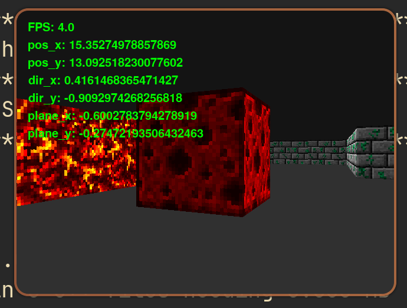

# Simulation environment

I like cocotb, and also this is the verification framework I'm most familiar
with, so it was a natural choice for this project.

Also, besides checking DUT values with a reference model, I wanted to visualize
simulated graphics, so I could see if it actually looks good. It was also very
useful when testing different fixed point widths to get optimal results.

Because the testing environment is all in Python, it is very easy to use any
existing Python libraries. For the graphics, I'm using
[pygame](https://www.pygame.org), which is a Python wrapper around
[SDL](https://www.libsdl.org/), which I used previously for my C project.

I wanted to create a test that would allow me to move around with my keyboard
controls, while drawing graphics in a window and checking that the DUT results
match a reference model.

Performing all checks at once turned out to be extremely slow and nowhere near
real time rendering, so I decided to split the test into multiple parts.

1. Lightweight floating point model, the reference implementation of the
   algorithm. Good for an introduction, to get the idea of what
   raycasting does and how it works (the code is small and pretty readable). And
   it runs at nearly real time (2-9 FPS).

2. Fixed point ray calculation model without any DUT checks. Good for debugging
   fixed point algorithm itself, just Python code, so not limited by simulator
   speed (0.4-1 FPS).

3. Fixed point ray calculation model with DUT checks. The scoreboard compares
   ray data in each column between the model and DUT output. Obviously slower,
   because of RTL simulation (0.04 FPS).

4. Fixed point rendering pipeline model with DUT checks. This covers second part
   of the rendering process, which starts with reading ray data from the SRAM
   and performing final pipeline calculation. Every pixel value is checked,
   nowhere near real time (0.0065 FPS or 155 seconds per frame).

## Fixed point models

I regret writing fixed point models in Python, it was truly horrible.

* Libraries that implement the arithmetic in Python are extremely slow, which
  made them absolutely unusable.

* There are some libraries with arithmetic operations written in C, which makes
  them much faster, yet still pretty slow. I ended up using
  [fpbinary](https://fpbinary.readthedocs.io/en/latest/intro.html).

* The main problem with fpbinary and other libraries I tried, is that even
  though they claim to be "designed with digital hardware in mind", the result
  of all operations automatically expands in width, so "the overflow is
  guaranteed to NOT happen". Which is actually very bad for hardware models,
  because you have fixed widths, and you don't necessarily want to increase
  twice the width every time you multiply, you're mostly fine with losing some
  fractional precision. And there is no option to NOT change the width, each
  expression with fixed point objects gives you a new object with the changed
  width.

The only solution for the last problem is to receive a new object, and then
manually resize it back to the initial width of your operands. All of this makes
the code look like garbage, as well as let the performance go down the drain.
But when I realized all of this, it was too late, so here we go.

The module `tb/fixedpoint.py` has some wrappers around fpbinary to make it a bit
more convenient to use.

To create a fixed point number, `fixp_init` is called:

```Python
def fixp_init(val, type, signed=False):
    int_bits, frac_bits = type

    fp_value = FpBinary(
        int_bits=int_bits, frac_bits=frac_bits, signed=signed, value=val
    )

    return FpBinarySwitchable(
        fp_mode=FP_MODE, fp_value=fp_value, float_value=val
    )
```

We create the `FpBinary` object with needed width and signedness, and then
`FpBinarySwitchable` object is created based on this. The only thing that
`FpBinarySwitchable` does is it allows to run all fixed point expressions with
regular floating point values, so you can check if the bug is related to fixed
point (like rounding, overflow, precision) and compare the quality.

To perform an expression with fixed point numbers, `fixp_expr` function is
called:

```Python
def fixp_expr(expr, num):
    int_bits, frac_bits = num.format

    if type(num.value) is FpBinary:
        fp_value = FpBinary(
            int_bits=int_bits,
            frac_bits=frac_bits,
            signed=num.value.is_signed,
            value=expr,
        )
    else:
        fp_value = expr

    return FpBinarySwitchable(
        fp_mode=FP_MODE, fp_value=fp_value, float_value=expr
    )
```

Because the width of the expression is messed up by automatic expansion, we have
to create a new object with desired width based on the expression value. `num`
is the fixed point object with target parameters (width and signedness).

If we just want to change the width of a fixed point number, we can call
`fixp_cast`:

```Python
def fixp_cast(num, fixp_type):
    int_bits, frac_bits = fixp_type
    return num.resize(
        format=(int_bits, frac_bits),
        round_mode=RoundingEnum.direct_neg_inf,
    )
```

During cast in RTL, I just truncate the bits without rounding, so I have to set
the rounding mode towards negative infinity. But `fixp_cast` can't replace
`fixp_expr`, because the expression can also mess up the sign, and there's no
way to change the sign of the existing object in this library.

Here's the `tex_x` calculation in fixed point model:

```Python
tex_step = fixp_expr(wall_dist * tex_step_scale, tex_step)

coord_x = fixp_init(0, fixp_pos)
proj_dist = fixp_init(0, fixp_proj, True)

if hit_side == 0:
    proj_dist = fixp_expr(wall_dist * ray_dir_y, proj_dist)
    fixp_cast(proj_dist, (0, POS_W_FRAC))
    coord_x = fixp_expr(pos_y + proj_dist, coord_x)
else:
    proj_dist = fixp_expr(wall_dist * ray_dir_x, proj_dist)
    fixp_cast(proj_dist, (0, POS_W_FRAC))
    coord_x = fixp_expr(pos_x + proj_dist, coord_x)

coord_x = fixp_expr(coord_x - math.floor(coord_x), coord_x)
tex_x = int(coord_x << math.ceil(math.log2(TEX_SIDE)))
```

As you can see, it is littered with `fixp_expr` and `fixp_cast` calls. It would
be much more clear and performant to just write fixed point logic in C and
communicate with the simulator via DPI.

## Executing tests

What wasn't horrible though is everything else related to creating a test in
Python.

Let's take a look at the rendering pipeline test.

```Python
@cocotb.test()
async def check_render(dut):
    await setup(dut)
    draw_background()

    cocotb.start_soon(render_monitor(dut))
    await render_scoreboard(dut)
    pg.quit()
```

First, we run the initial setup coroutine, then we start the monitor in the
background (`start_soon` is the same as `fork` in SystemVerilog). When
scoreboard coroutine finishes, we close pygame window and the test is finished.

The setup consists of resetting the DUT, initializing pygame, creating a monitor
queue and reading the whole map from the RTL.

```Python
async def setup(dut):
    global game_map, font, surface, mon_queue, time
    cocotb.start_soon(dut_reset(dut))

    # Pygame init
    pg.init()
    font = freetype.Font(None, 20)
    surface = pg.display.set_mode((FRAME_WIDTH, FRAME_HEIGHT))

    mon_queue = Queue()
    time = 0

    await RisingEdge(dut.px_clk)
    game_map = cocotb.top.raycast_top.map.value
```

The monitor is very simple as well:

```Python
async def render_monitor(dut):
    render = dut.raycast_top.render

    while True:
        await RisingEdge(dut.px_clk)

        if render.valids.value[0]:
            px_x = int(render.px_x_i.value) - 1
            px_y = int(render.px_y_p0.value)
            texture = int(render.rd_texture.value)
            tex_shade = int(render.rd_tex_shade.value)
            tex_x = int(render.rd_tex_x.value)
            tex_step = int(render.rd_tex_step.value) / 2**TEX_STEP_W_FRAC
            tex_height = int(render.rd_tex_height.value)

            mon_queue.put_nowait(
                (px_x, px_y, texture, tex_shade, tex_x, tex_step, tex_height)
            )
```

We just wait for the valid signal, read all the values for ray column and put
them in the queue for the scoreboard.

The pipeline output becomes valid by the time DVI has a delayed visible range
signal, so we grab the data from the pipeline output. The data from the monitor
is passed to the model to get the reference output. If the current pixel appears
to be within texture bounds, we draw it on the screen. Otherwise we don't draw
anything, because calling a draw function for every pixel is extremely slow. If
I were a game developer, I'd do something smarter, but the test is slow anyway,
so it doesn't really matter here.

Then the values between the DUT and the model are compared. If we have a
mismatch, the test is stopped and with `breakpoint()` you can interactively
debug from the test side.

When the whole frame is checked, scoreboard exits and the test finishes.

```Python
async def render_scoreboard(dut):
    while True:
        await RisingEdge(dut.px_clk)

        if dut.raycast_top.dvi_top.visible_range_del.value:
            px_x, px_y, texture, tex_shade, tex_x, tex_step, tex_height = (
                await mon_queue.get()
            )
            px_color, in_texture = render_model(
                textures, px_y, texture, tex_shade, tex_x, tex_step, tex_height
            )

            if in_texture:
                surface.set_at((px_x, px_y), px_color)
                pg.display.update()

            red, green, blue = px_color
            render = dut.raycast_top.render
            dut_red = int(render.red_o.value)
            dut_green = int(render.green_o.value)
            dut_blue = int(render.blue_o.value)

            await dut_assert(red, dut_red, "red", px_x, px_y)
            await dut_assert(green, dut_green, "green", px_x, px_y)
            await dut_assert(blue, dut_blue, "blue", px_x, px_y)

        if (
            dut.raycast_top.frame_done.value
            and not dut.raycast_top.render.buf_toggle.value
        ):
            break
```

Some basic information along with the `breakpoint()` is printed during mismatch:

```Python
async def dut_assert(expected, actual, var_name, x, y):
    try:
        assert expected == actual
    except AssertionError as e:
        print("=" * 80)
        print(f"X {x}")
        print(f"Y {y}")
        print(f"Expected {var_name}: {expected}, got {actual}")
        print("=" * 80)
        breakpoint()
        for _ in range(50):
            await RisingEdge(cocotb.top.px_clk)
        raise e
```

An additional 50 cycles are run to provide more information on the waveform.

## Runner

The conventional way is to run cocotb via the Makefile, but I prefer to
create a Python runner instead, so everything is set up in one language.

Another benefit is that it allowed me to create a simple list of options that
can be passed to the runner to choose the desired test:

```Python
test_name = "check_render"

try:
    arg_name = sys.argv[1]

    if arg_name == "--float":
        test_name = "float_raycast"
    elif arg_name == "--fixp_model":
        test_name = "fixp_model"
    elif arg_name == "--fixp_model_check":
        test_name = "check_column_calc"
except IndexError:
    pass
```

By default, rendering check is done, otherwise the user option is chosen.

After this, the corresponding test is started:

```Python
runner.test(
    hdl_toplevel=hdl_toplevel,
    test_module="tb.testbench",
    parameters=parameters,
    waves=waves,
    test_filter=test_name
)
```

## Final result

Pygame also provides a way to write text on the screen, so the main vectors
along with the FPS are printed for reference.


